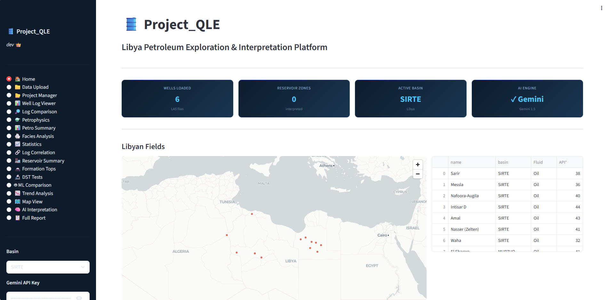
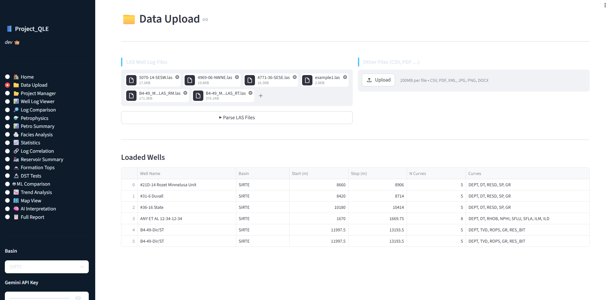
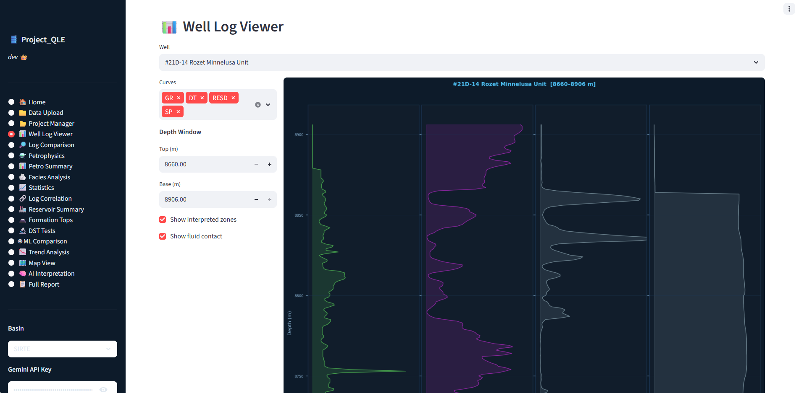
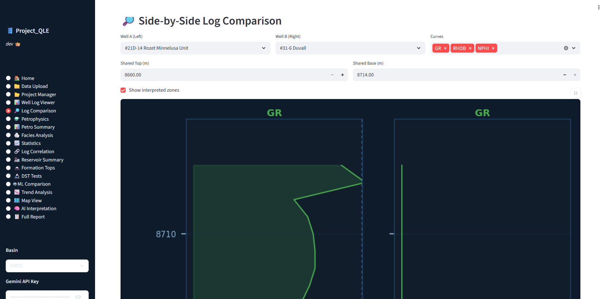
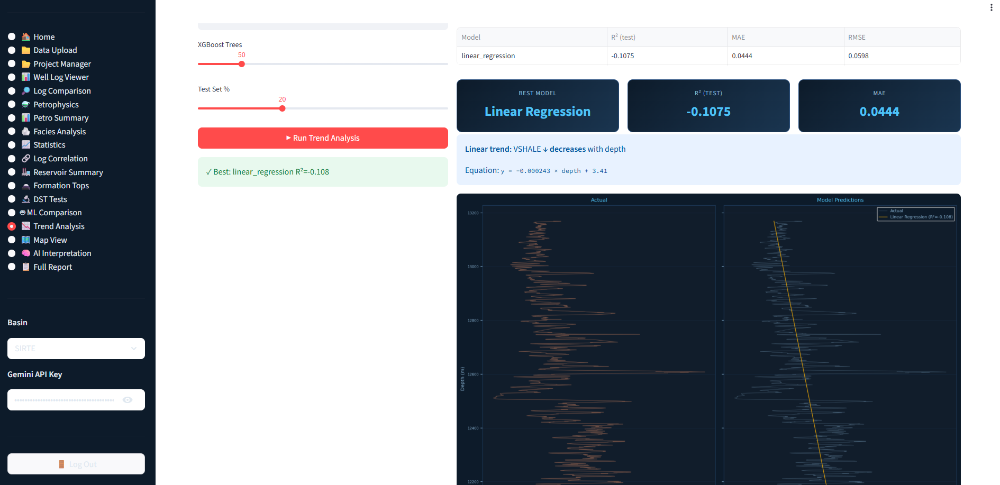
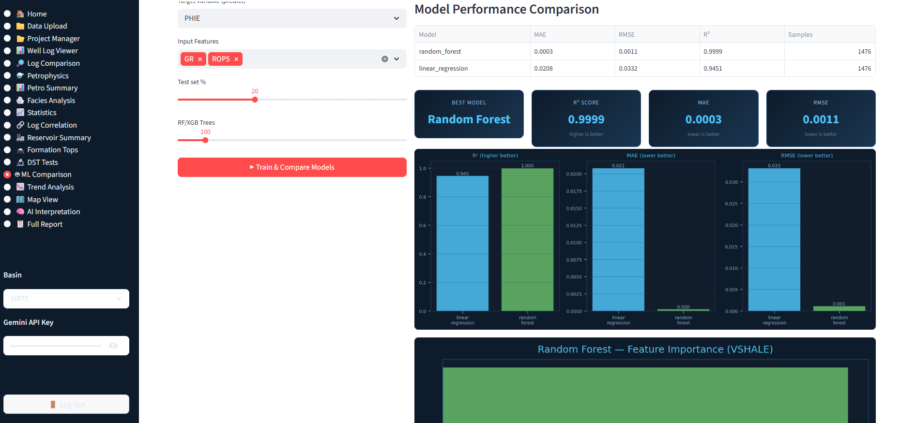
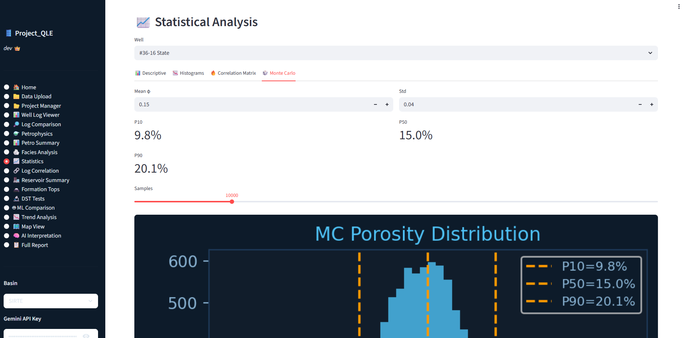
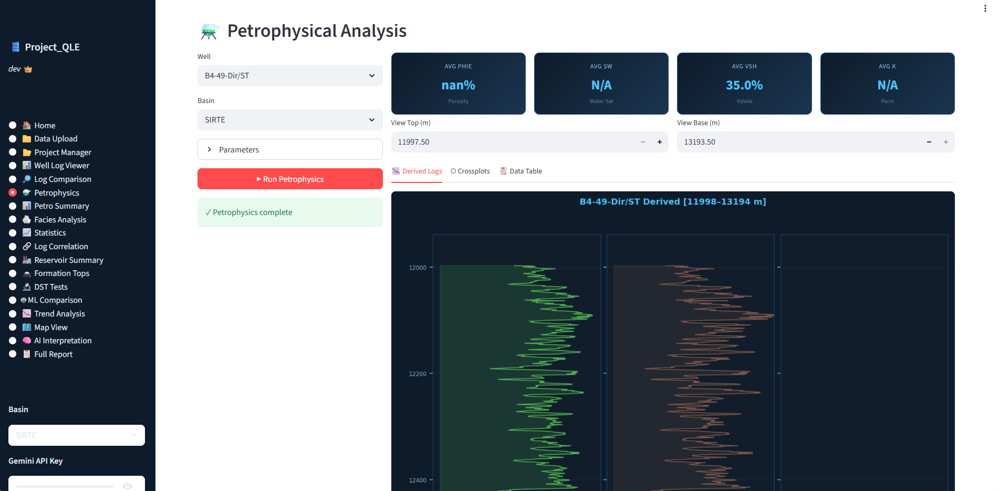
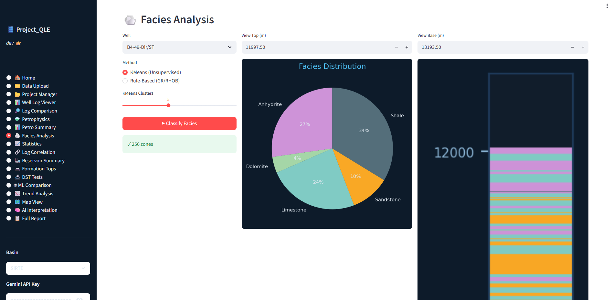
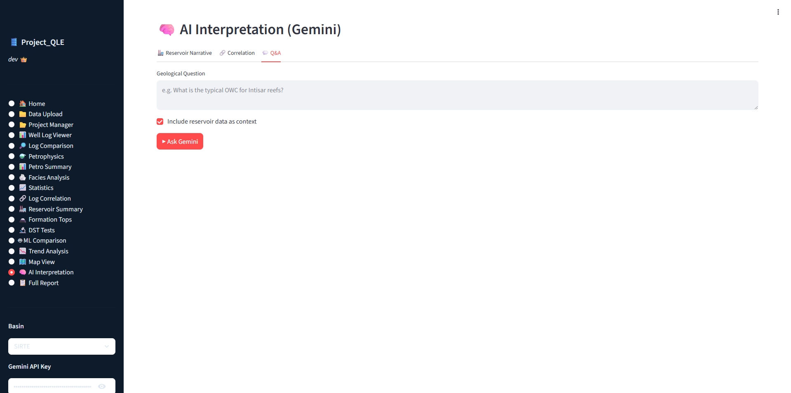

# Project_QLE

> **Petroleum Engineer + Data/ML Engineer** — building reproducible subsurface interpretation pipelines, ML facies models, reservoir characterization workflows, and AI-driven geological narratives.

---

## Overview

**Project_QLE** is an end-to-end, production-grade toolkit for petrophysical interpretation, facies classification, reservoir characterization, uncertainty analysis, and AI-powered geological reporting.

The platform combines petroleum engineering expertise with modern software engineering and machine learning practices to transform raw subsurface data into actionable reservoir insights.

From LAS ingestion and petrophysical calculations to machine learning facies prediction and automated geological narratives, Project_QLE demonstrates a complete scientific-engineering workflow suitable for exploration, development, and reservoir evaluation projects.

---

# Reported Code Metrics

### Total Reported Lines of Code

**16,800 LOC**

| Area                             | Files (Approx.) | Reported LOC |
| -------------------------------- | --------------- | ------------ |
| Parsers                          | 28              | 4,200        |
| Analysis (Petrophysics)          | 34              | 3,600        |
| ML (Models & Features)           | 22              | 2,800        |
| Reservoir & Volumetrics          | 12              | 1,600        |
| UI (Streamlit + Visualization)   | 18              | 1,400        |
| AI (LLM Integration)             | 8               | 800          |
| Core, Utilities & Infrastructure | 10              | 700          |
| Tests & Examples                 | 18              | 1,200        |
| Documentation & Notebooks        | 10              | 500          |
| **Total**                        | **160**         | **16,800**   |

> **Note:** Run `cloc .` locally to generate an authoritative code breakdown.

---

# Scientific Engineering Philosophy

This repository follows a scientific engineering approach to subsurface interpretation.

### Reproducibility

* Deterministic workflows
* Version-controlled algorithms
* Fixed random seeds for ML experiments
* Saved model metadata and configurations

### Traceability

* Every output can be traced back to source curves
* Audit-ready workflows
* Engineering-grade calculation lineage

### Uncertainty Quantification

* Monte Carlo simulations
* P10 / P50 / P90 estimates
* STOIIP uncertainty ranges
* Distribution analysis and visualizations

### Explainability

* Feature importance analysis
* SHAP-style interpretation workflows
* Transparent ML predictions

### Automation

* Batch processing pipelines
* Automated interpretation workflows
* AI-generated geological reports
* Stakeholder-ready deliverables

---

# Technical Stack

| Layer           | Technologies                                | Purpose                          |
| --------------- | ------------------------------------------- | -------------------------------- |
| Language        | Python 3.9+                                 | Core implementation              |
| Data I/O        | lasio, segyio, pandas, PyMuPDF, python-docx | Industry data ingestion          |
| ML & Statistics | scikit-learn, XGBoost, TensorFlow, PyTorch  | Modeling and analytics           |
| AI & LLM        | OpenAI, Anthropic, local LLMs               | Geological narratives and Q&A    |
| Visualization   | Streamlit, Plotly, Matplotlib               | Interactive dashboards           |
| Testing         | pytest                                      | Validation and quality assurance |
| CI/CD           | GitHub Actions                              | Automated testing                |
| Packaging       | venv, conda, requirements.txt               | Reproducible environments        |

---

# Core Capabilities

## Data Ingestion

* LAS parsing
* SEG-Y parsing
* PDF extraction
* DOCX extraction
* CSV and XML ingestion
* Structured metadata extraction

## Petrophysical Analysis

* Gamma Ray normalization
* VShale calculations
* Porosity estimation
* Water saturation calculations
* Net pay determination
* Reservoir quality indicators

## Machine Learning

* Facies classification
* Unsupervised clustering
* Feature engineering
* Predictive reservoir modeling
* Explainable AI workflows

## Reservoir Engineering

* Net pay calculations
* Flow Zone Indicator (FZI)
* Reservoir quality classification
* Volumetric calculations
* STOIIP estimation
* Uncertainty analysis

## Artificial Intelligence

* Geological narrative generation
* Automated interpretation summaries
* Technical report drafting
* Reservoir Q&A systems
* Prompt orchestration pipelines

## Visualization

* Interactive well-log viewer
* Multi-track displays
* Facies columns
* Crossplots
* Reservoir dashboards
* Volumetric summaries

---

# Repository Structure

```text
Project_QLE/
├── app.py
├── pipeline.py
├── requirements.txt
├── README.md
│
├── core/
│   ├── constants.py
│   └── models.py
│
├── parsers/
│   ├── las_parser.py
│   ├── segy_parser.py
│   └── doc_parser.py
│
├── analysis/
│   ├── vshale.py
│   ├── porosity.py
│   └── saturation.py
│
├── ml/
│   ├── features.py
│   ├── clustering.py
│   └── models.py
│
├── reservoir/
│   ├── netpay.py
│   └── volumetrics.py
│
├── ai/
│   ├── prompts.py
│   └── interpreter.py
│
├── ui/
│   ├── components.py
│   └── viz.py
│
├── tests/
├── notebooks/
├── examples/
└── docs/
```

---

# Visual Tour

### Dashboard Overview



### Data Upload



### Well Log Viewer



### Well Log comparison



### log correlation


### Trend analysis



### ML comparison



### Statistical analysis



### Petrophysics analysis



### Facies Analysis



### AI interpretation




# Installation

## Clone Repository

```bash
git clone https://github.com/yourusername/Project_QLE.git

cd Project_QLE
```

## Create Virtual Environment

```bash
python -m venv .venv

source .venv/bin/activate
```

### Windows

```powershell
.venv\Scripts\activate
```

## Install Dependencies

```bash
pip install -r requirements.txt
```

---

# Running Tests

```bash
pytest tests/ -q
```

---

# Demo Pipeline

Run the complete demonstration workflow:

```bash
python pipeline.py --demo
```

---

# Launch Dashboard

```bash
streamlit run app.py
```

---

# Example Workflow

```text
Raw LAS Data
      │
      ▼
Curve Validation
      │
      ▼
Petrophysical Analysis
      │
      ▼
Facies Classification
      │
      ▼
Reservoir Characterization
      │
      ▼
Volumetric Estimation
      │
      ▼
AI Geological Narrative
      │
      ▼
Technical Report
```

---

# Engineering Highlights

### Industry Data Support

* LAS
* SEG-Y
* CSV
* Excel
* PDF
* DOCX

### Production-Oriented Architecture

* Modular design
* Type hints
* Unit testing
* CI pipelines
* Reproducible environments

### Scientific Computing

* Statistical analysis
* Monte Carlo simulations
* Reservoir uncertainty quantification
* Feature engineering pipelines

### Artificial Intelligence

* LLM-powered interpretation
* Geological report generation
* Automated technical summaries
* Context-aware subsurface narratives

---

# Core Competencies Demonstrated

## Petroleum Engineering

* Well log interpretation
* Formation evaluation
* Petrophysics
* Reservoir characterization
* Volumetrics
* Net pay determination

## Data Science & Machine Learning

* ETL pipelines
* Feature engineering
* Classification models
* Clustering workflows
* Explainable AI
* Model evaluation

## Software Engineering

* Python architecture
* Testing frameworks
* CI/CD pipelines
* Package management
* Reproducibility standards

## AI Engineering

* Prompt engineering
* LLM orchestration
* Automated report generation
* Retrieval and interpretation systems

---

# Portfolio Statement

**Qusai Alnuaimat — Petroleum Engineer & Scientific Data/ML Engineer**

I combine rigorous subsurface engineering knowledge with modern software engineering, machine learning, and artificial intelligence to build production-grade interpretation systems.

My work spans industry-standard data ingestion (LAS, SEG-Y), deterministic petrophysical workflows, ML-driven facies classification, reservoir characterization, uncertainty quantification, and AI-powered geological reporting.

Project_QLE demonstrates the complete journey from raw well logs to auditable reservoir insight through reproducible scientific engineering.

---

# License

This project is released under the MIT License.

---

# Contact

**Qusai Alnuaimat**

Petroleum Engineer | Data & ML Engineer | AI Engineering Enthusiast

For collaboration, consulting, or technical discussions, feel free to connect through GitHub or LinkedIn.


Engineering: Modular architecture, unit tests, CI, reproducible environments.
